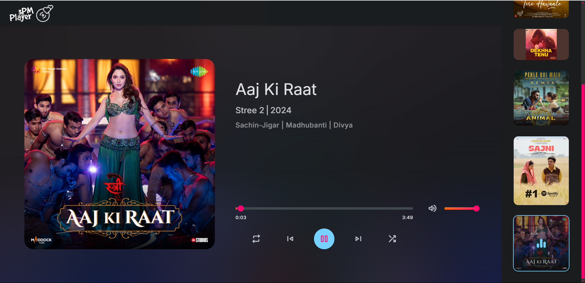

# 3PM Music Player

A responsive web music player built with HTML, CSS, and JavaScript. The project features a sleek design and a user-friendly interface, making it easy to play and manage your music library.

## Features

- **Responsive Design**: Mobile-friendly navigation bar and layout.
- **Dynamic Music Player Controls**: Includes play, pause, skip, repeat, and shuffle functionalities.
- **Volume Control**: Easily adjust the volume with a slider.
- **Seek Bar**: Control the playback position with a seek bar.
- **Track Information Display**: Shows the current track's title, album, and artist.
- **Playlist Management**: Add and view music tracks in a playlist.

## Screenshots



## Technologies Used

- **HTML5**
- **CSS3**
- **JavaScript**
- **Google Fonts**
- **Material Icons**

## Installation

To set up the project locally, follow these steps:

1. **Clone the Repository**:
   ```bash
   git clone https://github.com/SahilTwitZ/3PM-Player.git
   ```

2. **Navigate to the Project Directory**:
   ```bash
   cd 3PM Player
   ```

3. **Open the `index.html` File in Your Web Browser**:
   ```bash
   open index.html
   ```

## Usage

- Use the music player controls for playback, volume adjustment, and track seeking.
- Click on the hamburger menu to access navigation options on smaller screens.
- Manage your music library through the playlist section.

## Customization

You can customize the styles by modifying the `style.css` file located in the `assets/css/` directory. Feel free to change colors, fonts, and layouts to match your design preferences.

## Contributing

Contributions are welcome! If you have suggestions for improvements or bug fixes, please open an issue or submit a pull request.

1. **Fork the Project**.
2. **Create Your Feature Branch**:
   ```bash
   git checkout -b feature/YourFeature
   ```
3. **Commit Your Changes**:
   ```bash
   git commit -m 'Add some feature'
   ```
4. **Push to the Branch**:
   ```bash
   git push origin feature/YourFeature
   ```
5. **Open a Pull Request**.

## Acknowledgments

- Inspiration and design from various music player templates.
- Special thanks to the community for providing valuable resources and support.

## Contact

For any inquiries or feedback, please reach out to:

- **Md Shahil** - [sahil321nis@gmail.com](mailto:sahil321nis@gmail.com)
- [Your GitHub Profile](https://github.com/SahilTwitZ)
